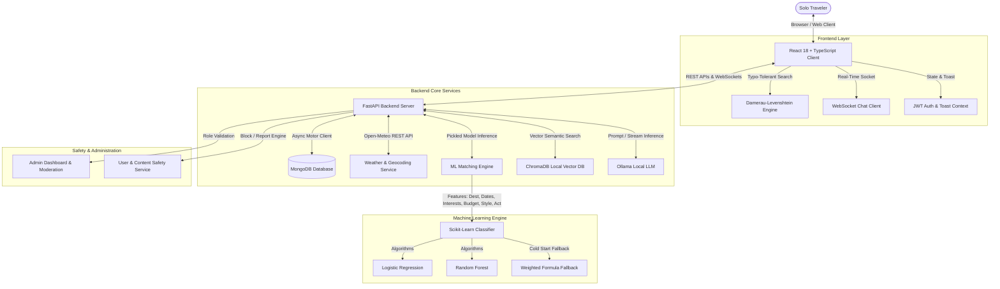

# TripMate AI — Autonomous Travel Companion & Collaboration Platform

[](https://opensource.org/licenses/MIT)
[](https://fastapi.tiangolo.com)
[](https://reactjs.org)
[](https://www.mongodb.com)
[](https://ollama.ai)
[](https://scikit-learn.org)

TripMate AI is a production-grade, privacy-first social travel planning, companion discovery, and collaborative scheduling platform. It combines **Local Generative AI** (Ollama + ChromaDB RAG) for personalized, weather-adapted itinerary planning with **Classical Machine Learning** (Scikit-Learn Logistic Regression & Random Forest) for intelligent travel buddy compatibility ranking.

---

## 📑 Table of Contents

1. [Project Overview & Problem Statement](#1-project-overview--problem-statement)
2. [Key Features by Phase](#2-key-features-by-phase)
3. [System Architecture Diagram](#3-system-architecture-diagram)
4. [Separation of Concerns: GenAI vs. Machine Learning](#4-separation-of-concerns-genai-vs-machine-learning)
5. [Tech Stack](#5-tech-stack)
6. [Machine Learning Matching Engine (Phase 4)](#6-machine-learning-matching-engine-phase-4)
7. [Local GenAI & Weather-Aware Planning (Phase 2 & 3)](#7-local-genai--weather-aware-planning-phase-2--3)
8. [Database Schema & Collections](#8-database-schema--collections)
9. [API Documentation](#9-api-documentation)
10. [Step-by-Step Installation & Local Setup](#10-step-by-step-installation--local-setup)
11. [Deployment Modes](#11-deployment-modes)
12. [Safety, Moderation & Privacy](#12-safety-moderation--privacy)
13. [Viva / Technical Interview FAQs](#13-viva--technical-interview-faqs)

---

## 1. Project Overview & Problem Statement

Solo traveling is experiencing explosive growth, yet solo travelers face two chronic challenges:
1. **Finding Compatible Companions:** Traditional travel forums lack compatibility ranking. Travelers must manually compare overlapping travel dates, destination cities, budgets, activity preferences, and travel styles.
2. **Dynamic Travel Planning:** Conventional itineraries are static and ignore real-time weather forecasts (e.g., scheduling open-air beach activities during torrential downpours), failing to adjust to personal interests or companion schedules.

**TripMate AI solves this** by providing:
- **Typo-Tolerant Destination Search Engine:** Multi-algorithm fuzzy matching (Damerau-Levenshtein + Jaro-Winkler + Popularity Ranking) that accurately resolves typos like `"Gao"` → **Goa, India**, `"Banglore"` → **Bengaluru**, and `"Hydrabad"` → **Hyderabad**.
- **Scikit-Learn Machine Learning Matching:** 6-feature vector analysis predicting traveler compatibility with transparent explainability and rule-based cold-start fallback.
- **Local GenAI Planner (Ollama + RAG):** Zero external cloud API fees, complete data privacy, and weather-aware itinerary generation using live Open-Meteo forecasts.
- **Shared Collaborative Workspace:** Real-time note sharing, place suggestions, joint packing checklist items, and group chat.
- **Role-Based Admin & Moderation:** Comprehensive reporting, blocking, user suspension, and system metrics.

---

## 2. Key Features by Phase

| Phase | Core Deliverables | Description |
| :--- | :--- | :--- |
| **Phase 1** | **Core Foundation & Auth** | FastAPI backend, MongoDB async driver, JWT auth with bcrypt hashing, Trip management, Profile management, and Responsive Tailwind CSS UI. |
| **Phase 2** | **AI Planner & Weather** | Real-time Open-Meteo forecasts, ChromaDB Vector DB, Ollama Local LLM (`llama3.2`), Weather-adapted itineraries, Smart packing lists, and Outfit suggestions. |
| **Phase 3** | **Social Discovery & Real-Time Chat** | Traveler discovery cards, Trip join requests, Mutual connection establishment, WebSocket real-time chat with auto-reconnect, and Notifications. |
| **Phase 4** | **ML Travel Buddy Matching** | 6-feature vector normalization, Scikit-Learn Logistic Regression & Random Forest models, explainable positive reasons & differences, and transparent cold-start fallback. |
| **Phase 5** | **Production Polish & Safety** | Shared trip collaboration workspace, User reporting/blocking, Role-protected Admin Dashboard, Graceful error handling, and Deployment configs. |

---

## 3. System Architecture Diagram



---

## 4. Separation of Concerns: GenAI vs. Machine Learning

TripMate AI maintains strict architectural boundaries:

```
┌─────────────────────────────────────────────────────────────────────────┐
│                           TRIPMATE AI SYSTEM                            │
├────────────────────────────────────┬────────────────────────────────────┤
│         GENERATIVE AI (GenAI)      │       MACHINE LEARNING (ML)        │
├────────────────────────────────────┼────────────────────────────────────┤
│ • Ollama (llama3.2 / mistral)      │ • Scikit-learn, Pandas, NumPy      │
│ • ChromaDB Vector Semantic Search  │ • Logistic Regression Classifier   │
│ • Weather-adapted Itineraries      │ • Random Forest Classifier         │
│ • Outfit suggestions               │ • 6-Vector Feature Normalization   │
│ • Smart packing checklists         │ • Travel Buddy Compatibility %     │
│ • Interactive Travel Assistant     │ • Match Tiers & Reason Ranking     │
│ • Local RAG Places Knowledgebase   │ • Transparent Rule-Based Fallback  │
└────────────────────────────────────┴────────────────────────────────────┘
```

---

## 5. Tech Stack

- **Frontend:** React 18, TypeScript, Tailwind CSS, Vite, Lucide Icons, React Router v6, Axios.
- **Backend:** FastAPI, Python 3.9+, Uvicorn, Motor (Async MongoDB), Pydantic v2, PyJWT, Passlib (Bcrypt).
- **Machine Learning:** Scikit-Learn, Pandas, NumPy, Joblib.
- **Generative AI & RAG:** Ollama (`llama3.2`), ChromaDB (Local Persistent Vector DB), LangChain Community.
- **External Data:** Open-Meteo Weather & Geocoding REST APIs (100% Free, Zero API Keys Required).
- **Database:** MongoDB (Local Community or MongoDB Atlas Cloud).

---

## 6. Machine Learning Matching Engine (Phase 4)

### Feature Engineering (Normalized to 0.0 – 1.0)
1. **Destination Similarity ($f_1$):** `1.0` if destinations match, `0.0` otherwise.
2. **Date Overlap Ratio ($f_2$):** $\frac{\text{Overlapping Days}}{\text{Total Trip Days}}$ ($0.0 \le f_2 \le 1.0$).
3. **Interest Similarity ($f_3$):** Jaccard Index of personal interests:
   $$J(A, B) = \frac{|A \cap B|}{|A \cup B|}$$
4. **Budget Similarity ($f_4$):** Normalized tier difference ($1.0 - \frac{|\text{Tier}_A - \text{Tier}_B|}{3.0}$).
5. **Travel Style Similarity ($f_5$):** Jaccard Index of travel styles.
6. **Activity Similarity ($f_6$):** Jaccard Index of trip activity interests.

### Cold-Start Transparent Formula (Rule-Based Fallback)
Before sufficient training data exists (< 10 interaction records):
$$\text{Score} = 25\%(f_1) + 25\%(f_2) + 20\%(f_3) + 15\%(f_4) + 10\%(f_5) + 5\%(f_6)$$
Clearly labeled as `"Rule-Based Compatibility"` in the UI.

### Match Tiers & Explainability
- **Tiers:** `Best Match` ($\ge 85\%$), `Strong Match` ($\ge 70\%$), `Good Match` ($\ge 55\%$), `Possible Match` ($\ge 35\%$), `Low Match` ($< 35\%$).
- **Explainability:** Generates human-friendly reasons (e.g. `✓ Same destination`, `✓ Complete date overlap`, `✓ 3 shared interests (Nature, Photography, Food)`) and transparent differences (e.g. `Different budget preference`).

---

## 7. Local GenAI & Weather-Aware Planning (Phase 2 & 3)

### Dynamic Weather Integration
1. Coordinates are resolved via Open-Meteo Geocoding.
2. 14-day daily weather forecasts (Temperature Max/Min, Precipitation Probability, Weather Code) are fetched dynamically.
3. If precipitation probability $> 50\%$, the AI prioritizes indoor cultural attractions (museums, cafes, galleries) over outdoor activities (beaches, trekking).

### Privacy-First Local LLM
- Runs 100% locally via **Ollama** (`http://localhost:11434`).
- No cloud AI API keys (no OpenAI, no Gemini).
- Zero user data sent to third-party AI companies.

---

## 8. Database Schema & Collections

- **`users`**: `id`, `name`, `email`, `password_hash`, `bio`, `home_city`, `travel_interests`, `preferred_travel_style`, `budget_preference`, `role` (`traveler` / `admin`), `is_suspended`, `created_at`.
- **`trips`**: `id`, `user_id`, `destination`, `start_date`, `end_date`, `approximate_budget`, `travel_interests`, `preferred_travel_style`, `number_of_travelers`, `description`, `created_at`.
- **`requests`**: `id`, `sender_id`, `receiver_id`, `trip_id`, `request_type` (`trip_join` / `buddy_request`), `status` (`pending` / `accepted` / `rejected`), `created_at`.
- **`connections`**: `id`, `user1_id`, `user2_id`, `trip_id`, `status` (`active`), `created_at`.
- **`messages`**: `id`, `connection_id`, `sender_id`, `content`, `timestamp`, `is_read`.
- **`match_interactions`**: `id`, `user_id`, `candidate_user_id`, `trip_id`, `candidate_trip_id`, `features` (6 normalized floats), `request_status`, `label` (`0` or `1`), `created_at`.
- **`collaborations`**: `id`, `trip_id`, `notes`, `suggested_places`, `saved_places`, `checklist`, `created_at`.
- **`reports`**: `id`, `reporter_id`, `reported_id`, `type` (`user` / `content`), `reason`, `details`, `status` (`pending` / `resolved`), `created_at`.
- **`blocks`**: `id`, `blocker_id`, `blocked_id`, `created_at`.
- **`notifications`**: `id`, `user_id`, `title`, `message`, `type`, `is_read`, `created_at`.

---

## 9. API Documentation

### Authentication & Profiles
- `POST /auth/signup` — Register new traveler profile.
- `POST /auth/login` — Login and receive JWT access token.
- `GET /auth/me` — Get authenticated user details.
- `PUT /auth/me` — Update preferences, styles, and bio.

### Trips & Discovery
- `GET /trips` — List user's created trips.
- `POST /trips` — Create new trip with geocoded coordinates.
- `GET /trips/{id}` — Get trip details.
- `GET /discovery/travel-buddies` — Discover compatible travelers.

### Machine Learning Matching
- `GET /matching/candidates` — Get ML-ranked candidates with score, tier, explainability reasons, and method.
- `GET /matching/{userId}` — Get detailed compatibility breakdown with a specific traveler.
- `POST /matching/score` — Compute match score for arbitrary trip/user payloads.
- `POST /ml/train` — Retrain Scikit-Learn classifier (`logistic_regression` or `random_forest`).
- `GET /ml/status` — Get active model status, algorithm, and dataset size.
- `GET /ml/metrics` — Get validation metrics and confusion matrix.

### AI & Weather
- `POST /ai/itinerary` — Generate weather-aware day-by-day itinerary.
- `POST /ai/packing-outfit` — Generate clothing recommendations and smart packing list.
- `POST /ai/chat` — Context-aware AI travel assistant.
- `GET /weather/forecast` — Real-time 14-day weather forecast from Open-Meteo.

### Collaboration & Workspace
- `GET /trips/{id}/collaboration` — Retrieve shared workspace.
- `POST /trips/{id}/collaboration/notes` — Add collaborative note.
- `POST /trips/{id}/collaboration/places` — Suggest a place.
- `GET /trips/{id}/collaboration/members` — List authorized trip collaborators.

### Safety & Admin
- `POST /safety/report` — Report inappropriate content or traveler.
- `POST /safety/block` — Block a user (breaks connections and hides discovery).
- `GET /admin/stats` — Admin dashboard system statistics (Admin only).
- `GET /admin/reports` — Review submitted reports (Admin only).
- `PUT /admin/users/{id}/suspend` — Suspend offending traveler account (Admin only).

---

## 10. Step-by-Step Installation & Local Setup

### Prerequisites
- **Node.js** v18+ and `npm`
- **Python** 3.9+
- **MongoDB** (running locally on `mongodb://localhost:27017` or MongoDB Atlas URI)
- **Ollama** ([https://ollama.ai](https://ollama.ai))

### 1. Start Ollama and Pull Model
```bash
# Start Ollama service
ollama serve

# Pull lightweight, state-of-the-art model
ollama pull llama3.2
```

### 2. Backend Setup
```bash
cd backend

# Create and activate virtual environment
python -m venv venv
# On Windows:
.\venv\Scripts\activate
# On macOS/Linux:
source venv/bin/activate

# Install dependencies
pip install -r requirements.txt

# Create environment file from example
cp .env.example .env

# Run comprehensive verification suite
python verify_production.py

# Start FastAPI server
uvicorn app.main:app --reload --port 8000
```

### 3. Frontend Setup
```bash
cd frontend

# Install dependencies
npm install

# Create environment file
cp .env.example .env

# Run build check
npm run build

# Start Vite development server
npm run dev
```

Visit **[http://localhost:5173](http://localhost:5173)** in your browser!

---

## 11. Deployment Modes

### Mode 1: Local Development & Evaluation (Recommended for Demos & Reviews)
- **Frontend:** React + Vite dev server (`http://localhost:5173`)
- **Backend:** FastAPI + Uvicorn (`http://localhost:8000`)
- **Database:** Local MongoDB (`mongodb://localhost:27017`)
- **LLM:** Local Ollama (`http://localhost:11434`)
- **Weather:** Open-Meteo live REST APIs

### Mode 2: Cloud Production Deployment
- **Frontend Client:** Deployed to **Vercel** or **Netlify** with `VITE_API_URL` pointing to the backend.
- **Backend Server:** Deployed to **Render** or **Railway** (Python 3.9+ Docker container).
- **Database:** Hosted on **MongoDB Atlas** with connection string in `MONGODB_URI`.
- **LLM Inference:** Self-hosted GPU instance (e.g., RunPod, AWS EC2, or dedicated Ollama server).
- **Weather:** Direct outbound HTTPS to Open-Meteo.

> **Note on Ollama Deployment:** Ollama is designed for dedicated or self-hosted GPU/CPU environments and cannot run inside serverless functions (like Vercel). For serverless demos, TripMate AI includes automatic graceful fallback to curated local RAG knowledgebases when Ollama is unreachable.

---

## 12. Safety, Moderation & Privacy

- **Travel Safety Notice:** Clear advisories reminding travelers to independently verify opening hours, transit bookings, local regulations, and emergency contacts.
- **Zero Hallucination Weather Policy:** Weather forecasts are strictly retrieved from Open-Meteo; the AI is forbidden from fabricating meteorological forecasts.
- **Reporting & Blocking:** Instant one-click blocking that severs all mutual requests, chat access, and discovery visibility.
- **Admin Moderation:** Role-protected admin console at `/admin` requiring verified administrator privileges.

---

## 13. Viva / Technical Interview FAQs

### Q1: Why use Scikit-Learn for travel buddy matching instead of Deep Learning?
> **Answer:** Travel buddy matching is a tabular classification problem with 6 clear feature signals (destination, date overlap, interests, budget, style, activities). Deep learning requires massive datasets (100k+ records) and acts as an unexplainable black box. Scikit-Learn (Logistic Regression & Random Forest) provides superior performance on small-to-medium datasets, trains in milliseconds, prevents overfitting, and offers complete mathematical explainability for candidate match reasons.

### Q2: Why use Ollama + RAG instead of OpenAI or Gemini API keys?
> **Answer:** Ollama guarantees 100% data privacy (travel plans and user itineraries never leave the local environment), eliminates cloud API subscription costs, prevents rate-limiting during grading/demos, and allows offline development. ChromaDB RAG injects verified local destination facts into prompts to eliminate LLM hallucinations.

### Q3: How do you handle cold-start when no ML training data exists?
> **Answer:** TripMate AI implements a transparent two-tier architecture: if dataset size is below threshold (< 10 records), it uses a weighted multi-factor compatibility formula (Dest 25%, Dates 25%, Interests 20%, Budget 15%, Style 10%, Act 5%) and clearly labels the result as `"Rule-Based Compatibility"`. Once interaction data accumulates, the Scikit-Learn model is trained and labeled as `"Trained ML Prediction"`.

---

## 📄 License
This project is open-source under the **MIT License**.
