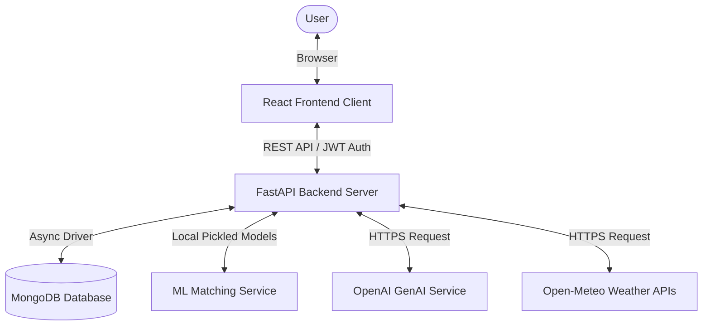

# TripMate AI — Social Travel & AI Planning Platform

TripMate AI is a modern full-stack travel scheduling and recommendation platform built for solo travelers. It pairs compatible travelers based on their travel preferences and generates weather-optimized, interest-prioritized AI travel itineraries and checklists.

---

## 1. Project Overview & Problem Statement

Solo traveling is one of the fastest-growing sectors in tourism, but finding companions with matching interests, overlapping dates, and compatible budgets remains a challenge. Travelers are often forced to choose between traveling alone or coordinating with friends whose schedules, budgets, or interests conflict.

**TripMate AI** resolves this by providing:
- **ML Buddy Matching:** Calculates compatibility scores to pair travelers going to similar locations around similar dates.
- **GenAI Planning:** Uses weather forecasts or historical averages to curate custom day-by-day itineraries, smart packing checklists, and clothing outfit suggestions.
- **Cooperative Collaboration:** Establishes a shared workspace where matched buddies can view shared trips, post sticky notes, suggest sites, and check off joint packing items.

---

## 2. Tech Stack

### Frontend Client
- **Core:** React 18, TypeScript, Vite
- **Styling:** Tailwind CSS, Lucide icons, custom Glassmorphism tokens
- **Routing:** React Router DOM v6
- **HTTP Client:** Axios (featuring JWT interceptors and auto-expired token redirect shields)

### Backend API
- **Web Framework:** FastAPI (Python)
- **Application Server:** Uvicorn
- **Database Driver:** Motor (async MongoDB client)
- **Authentication:** PyJWT, bcrypt password hashing, HTTPBearer header validation

### Machine Learning & Data Services
- **Libraries:** Scikit-learn, Pandas, NumPy
- **Algorithm:** Logistic Regression Match Classifier
- **Data Collections:** User blocks, reports, and connection interaction datasets

### External Integrations
- **Generative AI:** OpenAI Chat Completions API (`gpt-4o-mini` with structured JSON Mode)
- **Weather API:** Open-Meteo Geocoding, Forecast, and Archive APIs (14-day forecasts or historical averages)

---

## 3. Project Architecture

The platform separates client layouts, API controllers, database interfaces, and analytical modules.



---

## 4. Machine Learning Matching Approach

To pair compatible travelers, TripMate AI implements a two-stage matching engine:

### Stage A: Rule-Based Fallback (Phase 3A)
Before sufficient connection interactions exist, traveler compatibility is computed using a transparent weighted average:
- **Destination Similarity (25%):** 1.0 if cities match, 0.0 otherwise.
- **Date Overlap Ratio (25%):** Overlapping days divided by the user's trip duration.
- **Interest Similarity (20%):** Jaccard Index of profile interests:
  $$\text{Jaccard}(A, B) = \frac{|A \cap B|}{|A \cup B|}$$
- **Budget Similarity (15%):** Distance scaling based on budget tiers (Budget, Moderate, Premium, Luxury):
  $$\text{Similarity} = 1.0 - \frac{|\text{Tier}_A - \text{Tier}_B|}{3.0}$$
- **Travel Style Similarity (10%):** Jaccard Index of profile travel styles.
- **Activity Similarity (5%):** Jaccard Index of trip-specific interest tags.

### Stage B: Trained ML Prediction (Phase 3C)
When user interaction logs increase (request sent, accepted, or rejected), the administrator can trigger model retraining. 
1. The backend compiles the connection signals into a training dataset.
2. A **Logistic Regression Match Classifier** is trained using the 6 similarity vectors as features, and `label` (1 = accepted request, 0 = rejected/unresponsive request) as the target.
3. The trained classifier binary is pickled to disk, and the validation metrics (Accuracy, Precision, Recall, F1, Confusion Matrix) are written to `model_config.json`.
4. Subsequent discovery searches evaluate matches using the trained classifier's connection probability score.

---

## 5. Generative AI Prompting & AI Safety

### Plan Generation
When a traveler requests an AI Plan, the FastAPI server gathers geocoded weather forecasts (or historical averages if the trip is >14 days in the future).
- **Weather Adaptation:** If high rain probability (>50%) is detected on a day, the prompt instructs the AI to shift outdoor activities (beaches, parks) to clear slots, planning covered activities (museums, shopping, dining) for rain slots.
- **Interest Prioritization (Phase 3E):**
  - *Photography / Nature:* Prioritizes scenic viewpoints, sunrise/sunset times, and nature trails.
  - *Food / Culture:* Prioritizes local street food markets, local delicacies, and historical heritage sites.
- **AI Safety Safeguards:**
  - AI is explicitly prohibited from suggesting dangerous activities, off-limit districts, or unverified locations.
  - Prompts clearly instruct the AI to append verification advisories urging travelers to check opening hours, bookings, and local safety bulletins independently.
  - The AI assistant explicitly refuses to speculate on weather patterns beyond the provided API data.

---

## 6. Database Schema (MongoDB Document Collections)

### `users`
```json
{
  "id": "u_94857321",
  "email": "user@test.com",
  "name": "Jane Doe",
  "hashed_password": "$2b$12$hashedstring...",
  "profile_photo": "https://url...",
  "bio": "Solo traveler",
  "home_city": "New York",
  "interests": ["Photography", "Nature"],
  "travel_style": ["Adventure"],
  "budget_preference": "Moderate",
  "is_suspended": false,
  "created_at": "2026-07-30T09:00:00Z"
}
```

### `trips`
```json
{
  "id": "t_178535446",
  "user_id": "u_94857321",
  "destination": "Goa, India",
  "start_date": "2026-09-01",
  "end_date": "2026-09-07",
  "approximate_budget": 1200.0,
  "travel_interests": ["Photography", "Nature"],
  "preferred_travel_style": ["Adventure"],
  "number_of_travelers": 1,
  "description": "Landscape photography trip.",
  "created_at": "2026-07-30T09:05:00Z"
}
```

### `requests`
```json
{
  "id": "req_847392",
  "sender_id": "u_94857321",
  "receiver_id": "u_10293847",
  "trip_id": "t_178535446",
  "status": "accepted",
  "created_at": "2026-07-30T09:10:00Z"
}
```

### `connections`
```json
{
  "id": "conn_483920",
  "user1_id": "u_94857321",
  "user2_id": "u_10293847",
  "trip_id": "t_178535446",
  "created_at": "2026-07-30T09:12:00Z"
}
```

### `messages`
```json
{
  "id": "msg_9048392",
  "connection_id": "conn_483920",
  "sender_id": "u_94857321",
  "receiver_id": "u_10293847",
  "content": "Hi! Excited to travel together.",
  "timestamp": "2026-07-30T09:13:00Z",
  "is_read": false
}
```

### `ai_plans`
```json
{
  "trip_id": "t_178535446",
  "places": [
    {
      "name": "Baga Beach",
      "description": "Popular sandy beach.",
      "why_matches": "Scenic views for photography.",
      "suggested_duration": "2 hours",
      "recommended_visiting_period": "Evening",
      "activity_type": "Outdoor"
    }
  ],
  "visiting_times_explanation": {
    "morning": "Best for hiking",
    "afternoon": "Best for museums",
    "evening": "Best for sunset photography"
  },
  "itinerary": [
    {
      "day": 1,
      "morning": [{"place_name": "Baga Beach", "activity": "Landscape photography", "duration": "2 hours"}],
      "afternoon": [],
      "evening": []
    }
  ],
  "outfit_recommendations": ["Cotton shirts, sun hats, and sturdy sneakers."],
  "packing_checklist": {
    "clothing": [{"item": "T-shirts", "checked": false}],
    "weather": [{"item": "Sunscreen", "checked": true}],
    "personal_care": [],
    "electronics": [],
    "documents": [],
    "activity_specific": [],
    "emergency_essentials": []
  },
  "created_at": "2026-07-30T09:15:00Z"
}
```

### `collaborations`
```json
{
  "id": "col_102938",
  "trip_id": "t_178535446",
  "notes": [
    {
      "id": "nte_4839",
      "author_id": "u_94857321",
      "author_name": "Jane Doe",
      "content": "Meeting at airport terminal 2 at 10 AM.",
      "created_at": "2026-07-30T09:20:00Z"
    }
  ],
  "suggested_places": [
    {
      "id": "sug_2938",
      "name": "Agonda Fort",
      "description": "Historic landmark ruins.",
      "suggested_by_id": "u_10293847",
      "suggested_by_name": "John Smith",
      "status": "pending",
      "created_at": "2026-07-30T09:22:00Z"
    }
  ],
  "saved_places": [],
  "created_at": "2026-07-30T09:18:00Z"
}
```

### `reports`
```json
{
  "id": "rep_203948",
  "reporter_id": "u_94857321",
  "reported_id": "u_20394857",
  "type": "user",
  "reason": "Offensive profile bio description",
  "details": "User contains inappropriate content.",
  "status": "pending",
  "created_at": "2026-07-30T09:25:00Z"
}
```

### `blocks`
```json
{
  "id": "blk_48392",
  "blocker_id": "u_94857321",
  "blocked_id": "u_20394857",
  "created_at": "2026-07-30T09:28:00Z"
}
```

### `notifications`
```json
{
  "id": "not_58473921",
  "user_id": "u_94857321",
  "type": "request_received",
  "title": "New Travel Buddy Request",
  "message": "John Smith invited you to join their trip to Goa, India.",
  "link": "/requests",
  "is_read": false,
  "created_at": "2026-07-30T09:30:00Z"
}
```

---

## 7. Installation & Local Development

### Prerequisites
- Python 3.9+ or Python 3.12
- Node.js 18+
- MongoDB instance running locally (port 27017) or a MongoDB Atlas connection string

### Environment Configuration
Create a `.env` file under `backend/`:
```ini
MONGODB_URI=mongodb://localhost:27017
DATABASE_NAME=tripmate_db
JWT_SECRET=your_jwt_signing_secret_here
JWT_ALGORITHM=HS256
ACCESS_TOKEN_EXPIRE_MINUTES=10080
OPENAI_API_KEY=your_openai_api_key_here
PORT=8000
HOST=0.0.0.0
```

### Running the Backend
```bash
cd backend
python -m pip install -r requirements.txt
python -m uvicorn main:app --host 127.0.0.1 --port 8000 --reload
```

### Running the Frontend
```bash
cd frontend
npm install
npm run dev
```
Open your browser to [http://localhost:5173/](http://localhost:5173/).

---

## 8. Deployment Configurations

### Frontend (Vercel)
Deploy using the Vercel CLI or connect your Git repository. Ensure the environment variables are set:
- `VITE_API_URL` (Points to the deployed Render backend URL, e.g. `https://tripmate-backend.onrender.com`)

### Backend (Render or Railway)
Deploy the FastAPI app. Configure:
- **Build Command:** `pip install -r requirements.txt`
- **Start Command:** `uvicorn app.main:app --host 0.0.0.0 --port $PORT`
- **Environment Variables:** Set your production MongoDB Atlas URI, JWT Secrets, and OpenAI API Key.
